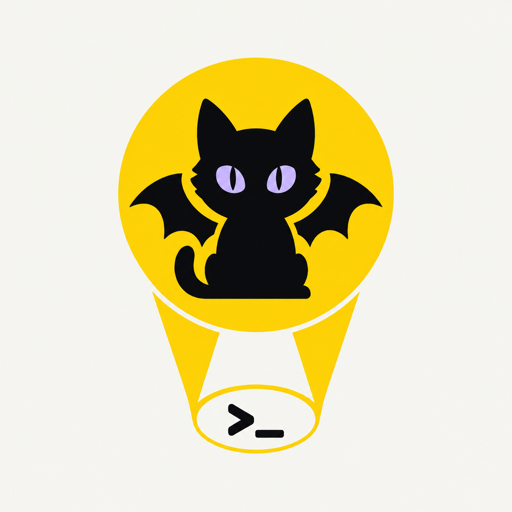
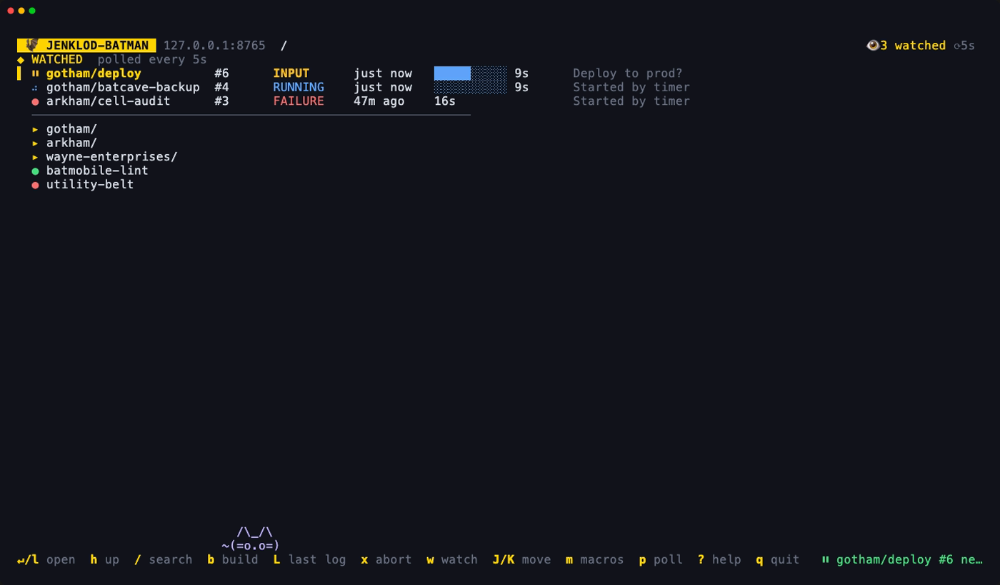

<p align="center">
  <picture>
    <source media="(prefers-color-scheme: dark)" srcset="assets/banner-dark.png" width="640">
    _ prompt" width="200">
  </picture>
</p>

# jenklod-batman 🦇

A terminal UI for Jenkins. Watch the jobs you care about, search every folder, approve deploys, and chain builds into macros without opening a browser. It has a bat-signal splash screen and a cat that lives in the status bar.

**📖 Documentation: [jenklod-batman.ytalbi.com](https://jenklod-batman.ytalbi.com/)**

<p align="center"></p>

## Install

```sh
brew install krank56/tap/jenklod-batman
# or
go install github.com/krank56/jenklod-batman@latest
```

Prebuilt archives for macOS and Linux (amd64 and arm64) are attached to each [release](https://github.com/krank56/jenklod-batman/releases). On first launch a setup form asks for your Jenkins URL, user and API token. The token goes to the system keyring, never to disk ([first run](https://jenklod-batman.ytalbi.com/guide/first-run)).

## Highlights

- **[Watched jobs](https://jenklod-batman.ytalbi.com/guide/watching):** pinned jobs at the top, with their last build, live progress and desktop notifications.
- **[Search](https://jenklod-batman.ytalbi.com/guide/search):** `/` fuzzy-matches jobs in every folder.
- **[Pipeline inputs](https://jenklod-batman.ytalbi.com/guide/inputs):** see and answer "Deploy to prod?" from the terminal.
- **[Macros](https://jenklod-batman.ytalbi.com/guide/macros):** saved build sequences, run in the TUI or with `jenklod-batman run <name>`.

## Keys

| Key | Action |
|---|---|
| `j`/`k`, `↑`/`↓`, `g`/`G`, `ctrl+d`/`ctrl+u` | move |
| `enter`, `l`, `→` | open folder, then job builds, then build log |
| `h`, `←`, `esc` | back |
| `/` | search: fuzzy matches in the current folder first, then in every other folder |
| `b` | build (a form opens for parameterized jobs; always asks y/n) |
| `R` | rebuild: the build form filled in with the selected build's parameters (the last build's, in the jobs list) |
| `x` | abort a running build (asks y/n); in the jobs list, the job's last build |
| `L` | in the jobs list: open the job's last build log |
| `i` | answer a paused pipeline `input` step, e.g. "Deploy to prod?" |
| `w` | watch or unwatch a job |
| `J`/`K` | move a watched job down or up |
| `p` | cycle the watch poll interval: 5, 10, 20, 30, 60s (saved) |
| `m` | macros |
| `o` | open in browser |
| `f` | follow log output |
| `r` | refresh |
| `a` | toggle the cat animation |
| `?` | help |
| `q` | back / quit |

The full list is in the [key reference](https://jenklod-batman.ytalbi.com/reference/keys).

## Development

```sh
make test                       # Go tests, UI included
go run ./cmd/demo-jenkins       # a simulated Jenkins to try the app against
cd docs && npm ci && npm run dev  # the docs site
```

[Development](https://jenklod-batman.ytalbi.com/contributing/development) and [releasing](https://jenklod-batman.ytalbi.com/contributing/releasing) are covered on the site.

## License

[MIT](LICENSE)
